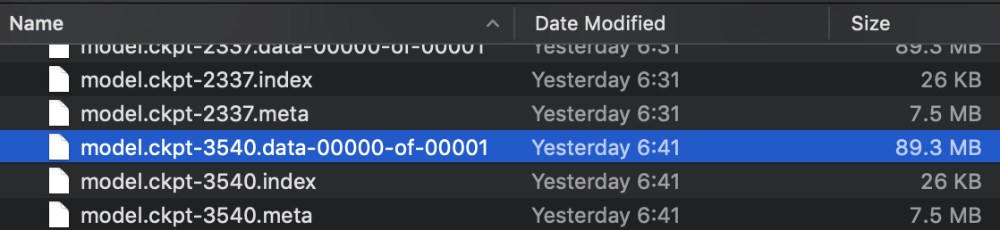
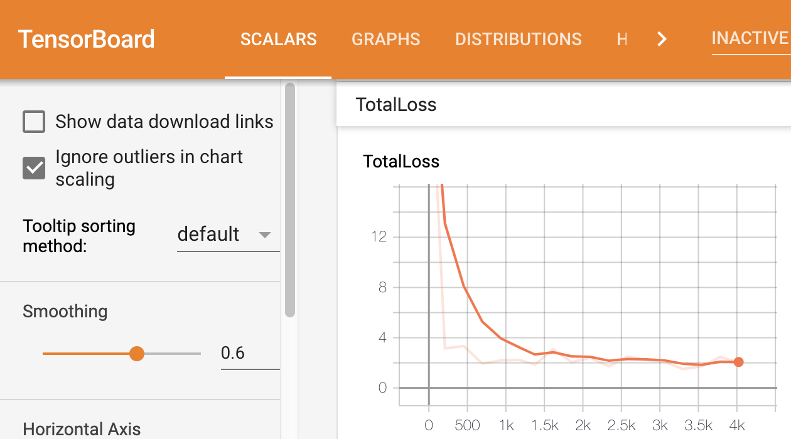
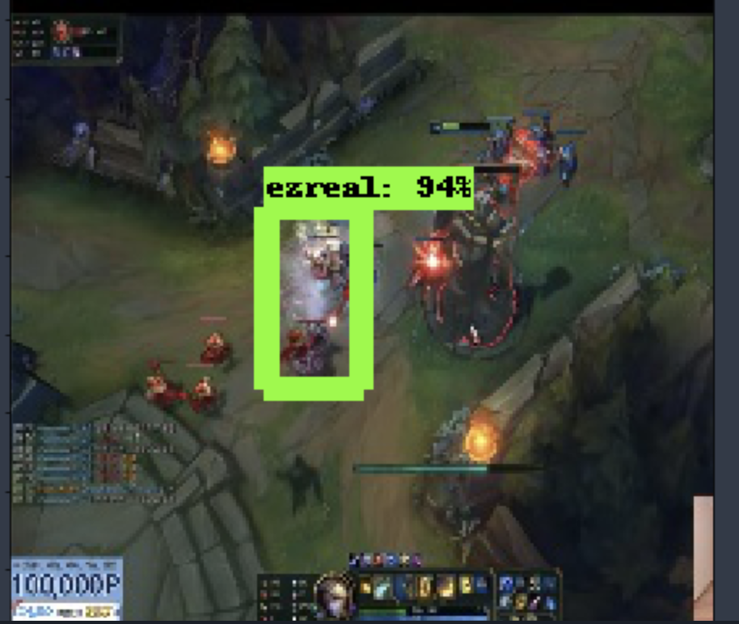
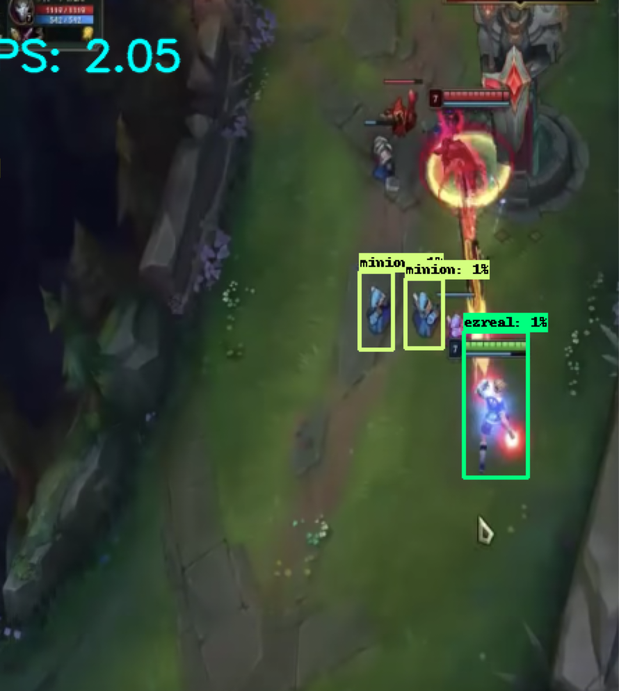

# Incubit_Project-AI_League_Of_Legends-

# Explaination (Classification and Object Detection)

# 1. Images

I respectively save 500 images of Tower, Minion, and Ezreal on League of Legends (Total 3 classes)
- Used parser or tf.run.flags to insert width, height, and filename
- Used cv2 to take each 500 pictures
- Saved those pictures with np.save(The size of .npy is 233.4 mb)

# 2. Model 

:Used AWS to use GPU that has p2.x2large to operate model. I have used 3540 epochs on GPU based on Object Detection.

# 3. Tensorboard(the function of early stopping is in the file, model.py) 

# 4. Result

# Installation

- You can install some packages, tensorflow, argparse, pillow, and numpy

`pip install -r requirement.txt`

# How to Use Classification and Object Detection

1. To create .npy and 500 pictures, use tf_save_image.py

`python tf_save_image.py --filename LOL_data.npy`

2. If you run it, the file LOL_data.npy on the folder of data is created and 1,500 images are saved on the image folder of images.

3. To seperate LOL_data.npy into two groups, train_data and image_data, you might as well use tf_load_image.py

`python tf_load_image.py --filename LOL_data.npy`

4. To create a model, you might use model.py that has CNN mode(I used early-stopping with patience = 5 and made the model stopped actumatically)

`python model.py`
`python prediction.py`

5. I used early-stopping with patience = 5 and made the model stopped actumatically

6. To make the box on the picture, ImageGrab on Pillow and Tensorflow Object Detection API might be used to detect ezreal, tower, and minion

# epoch = 1000

# epoch = 3540

